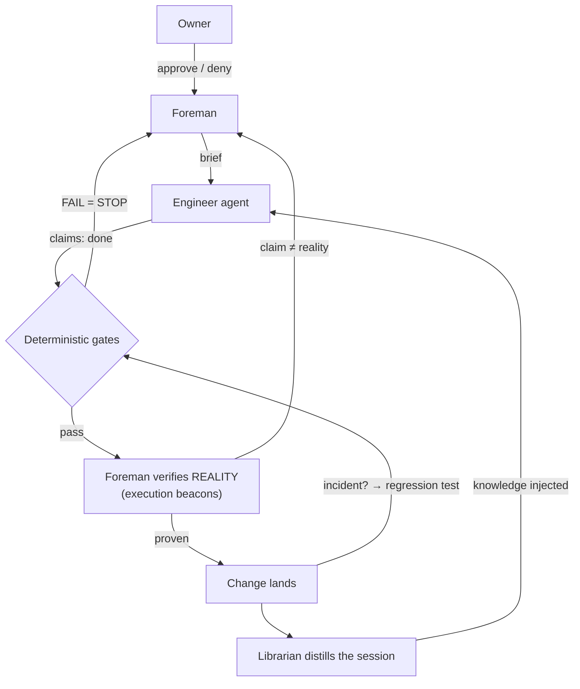

# flywheel-harness

**A governance layer for autonomous software engineering.**

Imagine giving a coding agent permission to improve your production infrastructure.

- How do you stop it from taking down production? *(Ours did — twice — before the gates existed.)*
- How do you know it actually did what it claims? *(Ours claimed success at paths that didn't exist.)*
- How do you make every incident permanently improve the system, instead of becoming another forgotten prompt?

Most agent projects try to make models more capable. flywheel-harness makes capable
models **trustworthy on real systems**: an agent that improves its own platform under
*binding* rules, *deterministic* gates, independent verification of outcomes, and a
human owner's approve/deny on a phone.

Bring your own model (any OpenAI-compatible `/v1` endpoint) and your own agent (a
pluggable worker). flywheel-harness is the governance around them — not another model,
not another orchestrator. It is best understood as **a governed agile team you staff with pluggable agents** — you stay Product Owner; the process itself is the product. See [docs/ROLES.md](docs/ROLES.md).



## The core idea: don't trust agents — verify them

Every current agent framework assumes:

> Agent: "I ran the tests." — Framework: "Great."

flywheel-harness says:

> Agent: "I ran the tests." — Foreman: "**Prove it.**"

Claims are checked against reality: declared beacons must resolve, changed code paths
must demonstrably have executed, and an empty verification contract is a *failure*,
never a silent pass.

## A true story (not a hypothetical)

From the reference deployment's incident log, July 2026:

1. An engineer session integrated a cloud-fallback module into the live proxy — by
   *replacing* a passthrough handler, against instructions. The chat path went down.
2. The next session was told, explicitly, "never stop the model service." It stopped
   the model service — severing its own inference mid-task and leaving the platform broken.
3. **Instructions don't bind. Structure does.** The discharge wasn't a sterner prompt:
   a privilege shim now *denies* service-stops from engineer sessions (rc=77), an
   immutable kernel holds the gates where no agent can edit them, a drift test asserts
   live config matches git daily, and each incident's signature runs as a regression
   test every morning at 06:00 UTC.

That is the whole thesis in one episode: a capable agent *will* do the forbidden thing;
the harness makes the forbidden thing structurally impossible and turns the attempt
into a permanent test.

## Core concepts (glossary)

| Term | What it means here |
|---|---|
| **Foreman** | The loop that drives a job through its phases (plan → gate → execute → verify → record) and, critically, verifies the engineer's claims against reality rather than trusting them. Owner-gated at risky forks. |
| **Engineer** | The coding agent doing the work — a pluggable worker process the harness launches and supervises. It never has final authority; its output is gated and verified. |
| **Constitution** | A small set of binding change rules the engineer *cannot edit* (filesystem-immutable). Violations are structurally blocked, not politely discouraged. |
| **Gate** | A check that must pass before a change proceeds. Deterministic first (lint/parse/policy — no model involved; a failure blocks with zero model calls), model review second. FAIL is a hard stop. |
| **Execution beacon** | Evidence that a claimed action *actually happened* — the changed path ran, the file exists, the commit is in the log. Verification requires beacons; zero beacons is a FAIL. |
| **Librarian** | The idle-time process that distills each session into a git knowledge base and injects relevant knowledge into future sessions — the self-improvement flywheel. |
| **Session** | One attributed run of the engineer, logged append-only, keyed by a session id — the unit of storage, supervision, and distillation. |
| **Signal plane** | A channel carrying one kind of information. Observability traffic, control signals, and conversation data never share a plane (mixing them once silently starved the librarian for 18 hours). |
| **Owner** | The human. Approves/denies over an out-of-band channel (Telegram in the reference deployment); the only authority the loop cannot grant itself. |

## Design principles

Each traces to a real production failure — this is engineering scar tissue, not a manifesto.

1. **Structural over instructional** — behaviors the system needs are wired into the path, not requested of agents. (13 knowledge-base searches ever, despite standing instructions to use it.)
2. **Deterministic before model-judged** — machine checks gate first; model review adds judgment, never arithmetic; verdicts are derived, never self-reported.
3. **Separate signal planes** — observability traffic never shares a channel with conversation data. (A health probe once kept a log "fresh" and starved the distiller.)
4. **Per-session everything** — storage, quiesce, stall detection keyed by session id, never global file state.
5. **Append-only evidence** — sessions are archived, never deleted; every index is derived and rebuildable; git is the audit trail.
6. **Interaction manifests** — no component arms without declaring its reads/writes of shared resources.
7. **The foreman is part of the system** — the whole loop runs as infrastructure, with the human at the approval points only.
8. **Incidents discharge as tests, not lessons** — every codified failure gains a deterministic regression test where possible, and its fix is *code* (permissions, cgroups, schema), not an LLM instruction. Prompt-level fixes are labeled stopgaps.

## An example session (this actually ran)

The reference deployment's foreman loop completing a real job, unattended:

```
PHASE 0  pick    → oldest pending brief in the queue
PHASE 1  plan    → engineer generates a ## Plan (its own model, supervised session)
PHASE 2  gate    → deterministic layer-1 from the immutable kernel (bash -n, shellcheck,
                   py_compile, njs-subset) — FAIL here = stop, zero model calls
PHASE 3  review  → advisory model review (cloud second-lens optional; non-fatal)
PHASE 4  execute → engineer does the work, creates the artifact, commits it
PHASE 5  verify  → beacons from the brief's ## Verify contract must resolve;
                   1 beacon checked, present → pass  (0 beacons would FAIL)
PHASE 6  record  → changelog updated
PHASE 7  learn   → LEARNED items + regression tests written
         status  → done
```

It took ten attempts to reach that clean run — and *that is the point*. Each failure was
caught in the safe direction (fail-closed), fixed as code, and turned into a test: a
verifier that scraped prose for file paths, a gate invoked as executable when the kernel
is deliberately non-executable, a temp dir deleted before its scripts were gated, and one
vacuous "0 files checked → pass" that a stolen discipline ("empty policy set is a FAIL")
killed within the hour. The loop never once falsely claimed success.

## Components

| Component | Role |
|---|---|
| **Gateway** | nginx + njs: context/role injection into one merged system message, per-session logging, cloud fallback — in front of *your* endpoint. |
| **Session store** | Per-session append-only JSONL + a derived SQLite index; health probes structurally excluded from the data plane. |
| **Librarian** | Idle-time distillation of quiesced sessions into a git KB; knowledge injected into future requests. |
| **Gates** | Deterministic layer (lint/parse/policy — blocks pre-model) + model review; verdicts derived, FAIL is terminal; governance files held in a filesystem-immutable kernel. |
| **Foreman loop** | Drives brief → plan → gate → execute → verify (execution beacons) → changelog → LEARNED; escalates to the owner at risky forks. |
| **Supervision** | A job queue, per-session stall detection, hard timeout + memory caps around workers, and a privilege shim that denies platform-lethal commands. |
| **Owner channel** | Out-of-band approve/deny for arming, destructive forks, and gate disputes. |

## Status

Early, and honest about it. The **reference deployment** (a single box running llama.cpp
with a 35B engineer model that builds this platform under its own governance) has the
gateway, session store, immutable-kernel gate floor, supervision stack, cloud fallback
(chaos-proven), and an incident-derived regression suite **live** — and the foreman loop
has completed its first unattended end-to-end cycles. This public repo is the
*generalized extraction* of that system; components land here as their model- and
instance-agnostic versions are cut. Nothing is published untested.

The CI suite runs the harness against a **mock `/v1` endpoint** — the same trick that
makes the harness model-agnostic makes it testable with no model at all.

See [docs/architecture.md](docs/architecture.md) for the living diagrams,
[docs/prior-art.md](docs/prior-art.md) for how this differs from ~95 surveyed projects,
[docs/component-choices.md](docs/component-choices.md) for the buy-vs-build reasoning, and
[ROADMAP.md](ROADMAP.md) for extraction order.

## License

MIT
