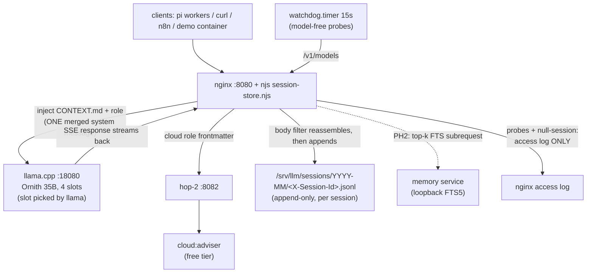
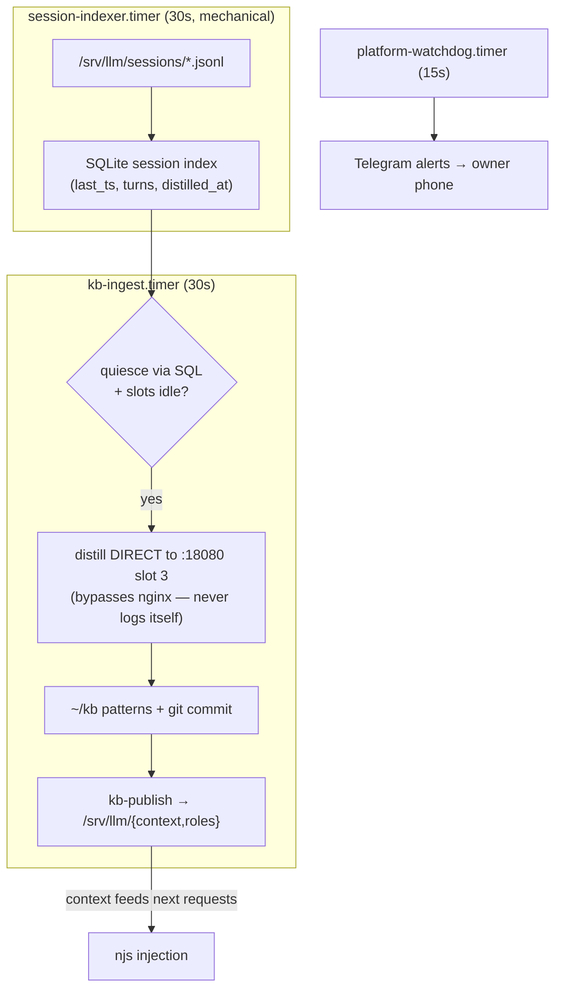
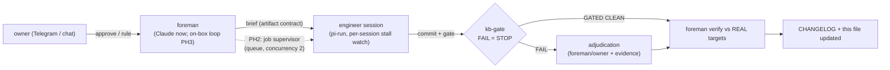
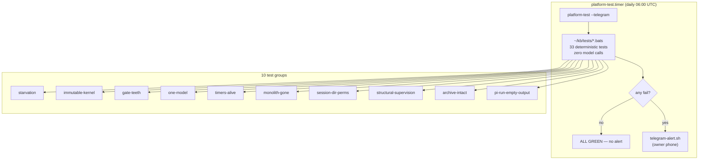
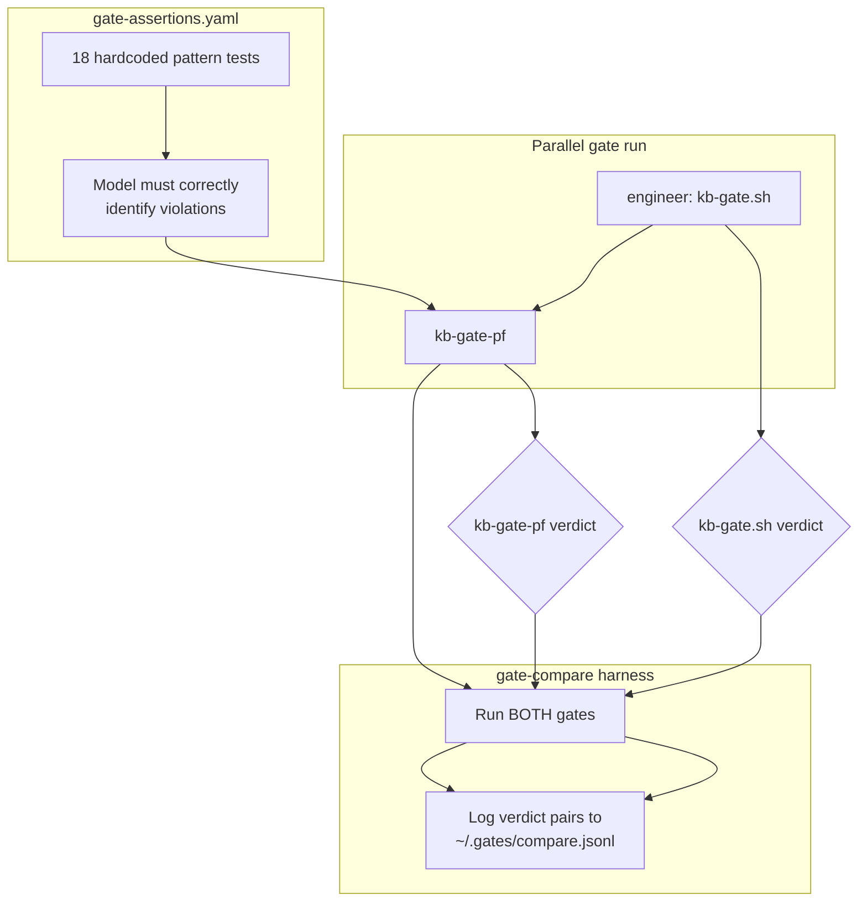

# Platform architecture — LIVING DIAGRAMS (mermaid)

Governance: any shipped change that alters structure MUST update this file in the
same commit series (definition-of-done, alongside the CHANGELOG entry). Legend:
solid = LIVE today; dashed = planned (phase tag in label).

## Inline flow (per request)



## Periodic flows (systemd user timers, not cron)



## Build governance loop



## Self-test loop (Rule 10)



## Gate floor (v2.0 phase 1)

```mermaid
flowchart TB
    subgraph source["~/kb (editable source, git-tracked)"]
        S1[kb-gate.sh.new]
        S2[kb-gated.sh]
        S3[harness-review-checklist.md]
        S4[kb-gate-sync.sh]
    end
    subgraph kernel["/srv/llm/gates/ (immutable, root:root 644)"]
        K1[kb-gate.sh]
        K2[kb-gated.sh]
        K3[harness-review-checklist.md]
        K4[constitution-excerpt.md]
    end
    subgraph layer1["Layer-1: deterministic (BEFORE model)"]
        L1B[bash -n + shellcheck] -->|.sh|. L1P[py_compile] -->|.py|. L1N[node --check] -->|.njs|
        L1F{any fail?}
    end
    subgraph layer2["Layer-2: model review (kb-review.sh)"]
        MR["kb-review.sh → ornith/cloud\nadversarial pattern check"]
    end
    subgraph sync["Foreman-only promotion"]
        SYNC["sudo kb-gate-sync.sh\nsource → /srv/llm/gates/"]
    end
    S1 -->|"engineer edits + git commit"| S1
    S4 -->|"foreman runs (sudo)"| SYNC
    S1 --> SYNC
    S2 --> SYNC
    S3 --> SYNC
    SYNC -->|"cp + chown root:root 644"| K1
    SYNC -->|"cp + chown root:root 644"| K2
    SYNC -->|"cp + chown root:root 644"| K3
    SYNC -->|"write constitution"| K4
    E -->|"kb-gate.sh <file>"| L1B
    L1F -->|"no"| MR
    L1F -->|"yes"| LF["FAIL — no model call"]
    MR -->|"GATE-FINDING lines"| V
```

**Immutable kernel**: `/srv/llm/gates/` holds root-owned active copies. Engineer
sessions cannot edit them. Source in `~/kb` remains editable. Promotion requires
`sudo kb-gate-sync.sh` run by foreman/owner. This prevents a compromised or
buggy engineer session from disabling or modifying the gate itself.

## Task supervision (v2.0 phase 2)

```mermaid
flowchart TB
    subgraph submit["pi-queue (engineer dispatch)"]
        P1["pi --print --session-id <SID>"] --> P2["pueue add --group engineer"]
        P2 --> P3["systemd-run --scope\nRuntimeMaxSec + MemoryMax=4G\nMemorySwapMax=0"]
        P3 --> P4["timeout --signal=TERM\n--kill-after=30"]
    end
    subgraph supervise["pi-watch.timer (65s)"]
        W1["For each Running task in engineer group"] --> W2["Extract session ID from task command"]
        W2 --> W3["Check /srv/llm/sessions/YYYY-MM/<SID>.jsonl size"]
        W3 --> W4{stalled?\n(no growth + no slot busy +\nno recent task-log mtime)\nfor 5 min?}
        W4 -->|yes| W5["pueue kill <TASK_ID>"]
        W4 -->|no| W6["Update marker file\nwith current size"]
    end
    subgraph verify["pi-queue post-submit"]
        V1["pueue add returns TASK_ID"] --> V2["Poll pueue status 10s\nwait for Running state"]
        V2 --> V3{task started?}
        V3 -->|no| V4["exit 126 with diagnostic"]
        V3 -->|yes| V5["Wait for rc file\nfrom wrapper inside scope"]
    end
    subgraph complete["Task completion"]
        C1["rc file written by wrapper"] --> C2["Check log for model output\n(SSE data: lines or reasoning)"]
        C2 --> C3{empty output?\n(rc=0 but <50 bytes +\nzero output lines)}
        C3 -->|yes| C4["Rewrite rc=125 (WEDGE)\nwith diagnostic"]
        C3 -->|no| C5["Emit log + exit rc"]
    end
    P1 --> submit
    P4 --> supervise
    V1 --> verify
    V5 --> complete
```

**Supervision flow**:
- **pi-queue**: submits pi tasks through pueue (queue, groups, parallel=1) + systemd-run (transient cgroup scopes with RuntimeMaxSec + MemoryMax=4G + MemorySwapMax=0). Post-submit verification polls pueue status for 10s to confirm task starts; aborts with clear diagnostic if it doesn't. Empty-output guard rewrites rc=0 to rc=125 (WEDGE) when log has no model output (catches context exhaustion masking as success).
- **pi-watch**: systemd user timer fires every 65s. For each Running task in the "engineer" group, extracts session ID, checks per-session file size growth + slot-busy + task-log mtime. If stalled (no growth + no activity) for 5 minutes, kills the task via `pueue kill <TASK_ID>`. Queue stays healthy — other tasks unaffected.
- **Kill-test evidence**: submitted pi task via pi-queue, SIGSTOPped pi process, pi-watch detected stall at ~6 min and killed task (exit 143 = SIGTERM). Queue remained healthy throughout.

## Eval integration (v2.0 phase 3)



**Eval flow**:
- **kb-gate-pf**: promptfoo-backed gate that runs gate-assertions.yaml rubric. Layer-1: deterministic syntax checks (bash -n, shellcheck, py_compile, node --check). Layer-2: promptfoo eval with deterministic verdict derivation from JSON output. FAIL CLOSED on unparseable JSON or missing output. Same gate-record schema as kb-gate.sh.
- **gate-compare**: harness that runs BOTH kb-gate.sh and kb-gate-pf on a file, logs verdict pairs to ~/.gates/compare.jsonl. Does NOT modify kb-gate.sh. Used to validate agreement between the two gate implementations.
- **gate-assertions.yaml**: 18 hardcoded pattern tests that verify the model can correctly identify code patterns (ROOT-FILE-WRITE-NO-SUDO, SET-E-IN-LONG-RUNNER, etc.). Uses openai:chat:ornith provider through proxy with X-Session-Id: gate-eval.
- **Provider wiring**: stock openai:chat:ornith works through proxy. Deleted dead provider attempts (custom-provider.mjs, pf-provider.js/mjs/yaml, provider-config.yaml).
- **NOTE**: Model is currently failing all 18 assertion tests — this indicates the assertions need refinement or the model needs prompting adjustments. Not a script bug.

## Privilege guard + cloud fallback + foreman loop (2026-07-18)

```mermaid
flowchart TB
    subgraph guard["Privilege guard (incident-2 discharge)"]
        L["pi-run / pi-queue launch"] -->|"PATH prepend"| SH["engineer-sudo shim"]
        SH -->|"systemctl stop/restart llama|nginx,\ngate-dir tamper, sudoers edit"| DENY["DENY rc=77 + log"]
        SH -->|"anything else"| FWD["log + forward to /usr/bin/sudo"]
    end
    subgraph fb["Cloud fallback (chaos-proven)"]
        C[client] --> H1["hop-1 :8080\n+ X-LLM-Fallback-* headers\n(empty when X-No-Fallback)"]
        H1 --> H2["hop-2 :8082\nproxy_pass primary upstream"]
        H2 -->|"502/504"| NF["@cloud_fallback\nguard: empty header => 502\nlazy body: model swapped to adviser"]
        NF --> CLOUD["free cloud tier"]
        H2 -->|"200"| LLM["local llama.cpp"]
    end
    subgraph loop["Foreman loop (skeleton GATED CLEAN; timer NOT armed)"]
        Q["~/kb/queue/*.md briefs\n(frontmatter: risk-class, collar)"] --> FL["foreman-loop.sh"]
        FL --> PW["plan -> gate (IMMUTABLE KERNEL)\n-> review -> execute -> verify\n-> changelog -> LEARNED"]
        PW -->|"approve/deny"| TG2["Telegram owner gate"]
        PW -->|"same-step fail x2"| ESC["STOP + alert"]
        FL -->|"capability-manifest.yaml"| CAP["vehicles, collar sizing,\ninterlocks, parallel lanes"]
    end
    subgraph dr["Disaster recovery"]
        KBGIT["~/kb git (canonical)"] -->|"post-commit hook, async"| MIR["github.com/gsrunion/steve-llm-kb\n(private mirror)"]
    end
