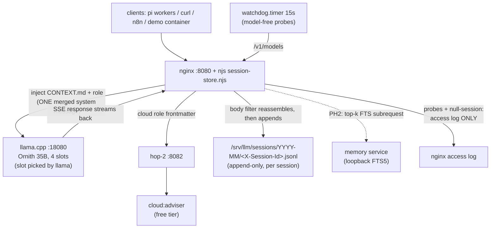
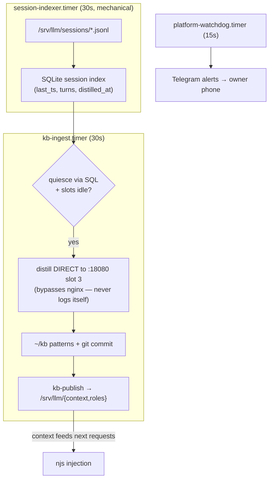
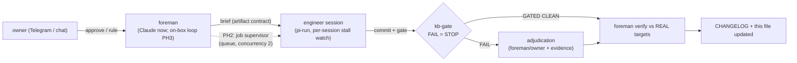

# Architecture — living diagrams (mermaid)

> These diagrams describe the **reference deployment** (a single box running llama.cpp
> with a 35B engineer model). Model names, paths, and the "Ornith" endpoint are
> placeholders for *your* OpenAI-compatible endpoint and *your* agent — the harness
> contract is only the `/v1` API and a launchable worker process.

Governance: any shipped change that alters structure MUST update this file in the
same commit series (definition-of-done, alongside the CHANGELOG entry). Legend:
solid = LIVE today; dashed = planned (phase tag in label).

## Inline flow (per request)

## Periodic flows (systemd user timers, not cron)

## Build governance loop

