# Job lifecycle — state machine

What happens to a unit of work from the moment the foreman picks it up. Solid
transitions are live in the reference deployment; ⚠ marks gaps found during drill 1
(2026-07-18) that define the next build.

```mermaid
stateDiagram-v2
    [*] --> Picked: oldest pending brief\n(status → running)

    Picked --> Planning: Phase 1
    Planning --> Gating: ## Plan ready\n(skipped if pre-seeded)
    Planning --> Failed: collar timeout (rc 124/137)\n⚠ real jobs die here today\n(prompt-cache thrash, no KV reuse)

    Gating --> Reviewing: layer-1 + gate PASS
    Gating --> Failed: gate FAIL\n(deterministic, zero model calls)

    Reviewing --> ApprovalGate: review done\n(advisory, non-fatal — never blocks)

    ApprovalGate --> Executing: no approval required\nOR owner approves
    ApprovalGate --> Denied: owner denies
    ApprovalGate --> ApprovalGate: poll for reply\n⚠ no timeout — hangs until\nsystemd 90-min kill

    Executing --> Verifying: work done,\nartifact + commit
    Executing --> Failed: execute error (rc≠0)

    Verifying --> Recording: beacons resolve\n(≥1 required; 0 beacons = FAIL)
    Verifying --> Failed: beacon missing / unresolvable

    Recording --> Learning: changelog written (non-fatal)
    Learning --> Done: LEARNED + regression tests

    Done --> [*]: status → done
    Denied --> [*]: status → denied\n(escalation exit)
    Failed --> [*]: status → failed\n⚠ TERMINAL — no retry\n(escalation-at-2 is dead code)
```

## The phases

| # | State | What it does | Fail-closed? |
|---|---|---|---|
| 0 | **Picked** | Oldest pending brief in the queue; marked `running` | — |
| 1 | **Planning** | Engineer generates a `## Plan` (its own model, supervised session); skipped if the brief is pre-seeded | Yes — timeout ⇒ Failed |
| 2 | **Gating** | Deterministic layer-1 (lint/parse/policy from the immutable kernel) then model review; FAIL is terminal, zero model calls on a layer-1 fail | Yes — FAIL ⇒ Failed |
| 3 | **Reviewing** | Advisory model review (optional cloud second lens); **non-fatal** — its failure is logged, never blocks and never pages the owner | n/a — always continues |
| 4a | **ApprovalGate** | If the brief requires approval, halt and alert the owner; poll for approve/deny | Yes — deny ⇒ Denied |
| 4b | **Executing** | Engineer does the work, creates the artifact, commits it | Yes — error ⇒ Failed |
| 5 | **Verifying** | Execution beacons from the brief's `## Verify` contract must resolve; **zero beacons is a FAIL**, never a silent pass | Yes — missing/zero ⇒ Failed |
| 6 | **Recording** | Changelog updated (non-fatal) | n/a |
| 7 | **Learning** | LEARNED items + regression tests written (non-fatal) | n/a |

## The three ⚠ gaps (drill-1 findings → next build)

1. **Failed is terminal.** A transient failure (a plan-phase timeout, a wedge) permanently
   kills the job. There is no retry, so the escalation-at-two-failures threshold is dead
   code — nothing ever retries to reach two. **Fix:** retry-once on transient classes,
   then escalate on exhaustion.
2. **The plan phase is the weak point.** Real (non-pre-seeded) jobs time out here because
   the static context is re-injected and re-prefilled every call. **Fix:** KV-cache reuse
   (reliability, not optimization) + a separate, shorter plan collar.
3. **Approval polling has no timeout.** An unanswered approval hangs the cycle until
   systemd's kill. **Fix:** timeout-with-default-deny.

These three converge into one layer — **retry-then-escalate with a faster plan phase** —
which is also the minimal form of the work-decomposer: "a job failed, generate a
continuation attempt" is a one-node decomposition.
