# Job lifecycle — state machine

What happens to a unit of work from the moment the foreman picks it up. Solid
transitions are live in the reference deployment; ⚠ marks gaps found during drill 1
(2026-07-18) that define the next build.

```mermaid
stateDiagram-v2
    [*] --> Picked: oldest pending brief<br/>(status → running)

    Picked --> Planning: Phase 1
    Planning --> Gating: ## Plan ready<br/>(skipped if pre-seeded)
    Planning --> Failed: collar timeout (rc 124/137)<br/>⚠ real jobs die here today<br/>(prompt-cache thrash, no KV reuse)

    Gating --> Reviewing: layer-1 + gate PASS
    Gating --> Failed: gate FAIL<br/>(deterministic, zero model calls)

    Reviewing --> ApprovalGate: review done<br/>(advisory, non-fatal — never blocks)

    ApprovalGate --> Executing: no approval required<br/>OR owner approves
    ApprovalGate --> Denied: owner denies
    ApprovalGate --> ApprovalGate: poll for reply<br/>⚠ no timeout — hangs until<br/>systemd 90-min kill

    Executing --> Verifying: work done,<br/>artifact + commit
    Executing --> Failed: execute error (rc≠0)

    Verifying --> Recording: beacons resolve<br/>(≥1 required; 0 beacons = FAIL)
    Verifying --> Failed: beacon missing / unresolvable

    Recording --> Learning: changelog written (non-fatal)
    Learning --> Done: LEARNED + regression tests

    Done --> [*]: status → done
    Denied --> [*]: status → denied<br/>(escalation exit)
    Failed --> [*]: status → failed<br/>⚠ TERMINAL — no retry<br/>(escalation-at-2 is dead code)
```

## The phases

Each state maps to an agile role — the lifecycle is a kanban board, and the phase
transitions are the role hand-offs (see [ROLES.md](ROLES.md)).

| # | State | Agile role | What it does | Fail-closed? |
|---|---|---|---|---|
| 0 | **Picked** | Scrum Master | Foreman pulls the oldest pending brief off the backlog; marked `running` | — |
| 1 | **Planning** | Developer | Engineer generates a `## Plan` (its own model, supervised session); skipped if pre-seeded | Yes — timeout ⇒ Failed |
| 2 | **Gating** | QA (CI) + Code Reviewer | Deterministic layer-1 (lint/parse/policy from the immutable kernel) then model review; FAIL is terminal, zero model calls on a layer-1 fail | Yes — FAIL ⇒ Failed |
| 3 | **Reviewing** | Code Reviewer (2nd lens) | Advisory model review (optional cloud lens); **non-fatal** — logged, never blocks or pages | n/a — always continues |
| 4a | **ApprovalGate** | **Product Owner** | If the brief requires approval, halt and alert the owner; poll for approve/deny | Yes — deny ⇒ Denied |
| 4b | **Executing** | Developer | Engineer does the work, creates the artifact, commits it | Yes — error ⇒ Failed |
| 5 | **Verifying** | QA (acceptance) — *distrustful* | Execution beacons from the brief's `## Verify` contract must resolve; **zero beacons is a FAIL**, never a silent pass | Yes — missing/zero ⇒ Failed |
| 6 | **Recording** | Scrum Master | Changelog updated (non-fatal) | n/a |
| 7 | **Learning** | Retrospective (Librarian) | LEARNED items + regression tests written (non-fatal) | n/a |
| — | **Done / Denied / Failed** | Product Owner accepts / rejects | Done = increment accepted; Denied = PO rejection; Failed = QA/SM rejection | — |

The **Foreman wears three hats** across the board — Scrum Master at the edges (Picked,
Recording, cadence), the *skeptical* QA-lead at Verifying ("prove it" rather than trust),
and the driver of every hand-off. The **Developer** owns the two doing-states (Planning,
Executing); the **Product Owner** owns exactly the two gates a machine can't verify
(ApprovalGate, final acceptance); the **Librarian** owns the retro. Two role-breaks from
ROLES.md sit right on the board: Verifying is QA that *distrusts* the developer, and
Learning is a dedicated retro *state* only because the developers are amnesiac.

## The three ⚠ gaps (drill-1 findings → next build)

1. **Failed is terminal.** A transient failure (a plan-phase timeout, a wedge) permanently
   kills the job. There is no retry, so the escalation-at-two-failures threshold is dead
   code — nothing ever retries to reach two. **Fix:** retry-once on transient classes,
   then escalate on exhaustion.
2. **The plan phase is the weak point.** Real (non-pre-seeded) jobs time out here because
   the static context is re-injected and re-prefilled every call. **Fix:** KV-cache reuse
   (reliability, not optimization) + a separate, shorter plan collar.
3. **Approval polling has no timeout.** An unanswered approval hangs the cycle until
   systemd's kill. **Fix:** timeout-with-default-deny.

These three converge into one layer — **retry-then-escalate with a faster plan phase** —
which is also the minimal form of the work-decomposer: "a job failed, generate a
continuation attempt" is a one-node decomposition.

## Where is the loop?

The diagram above is one *job's* lifecycle — it is linear and it terminates. The "loop"
is two things, and the honest picture is that one exists outside it and one does not exist yet.

```mermaid
stateDiagram-v2
    Idle --> Idle: timer tick, queue empty (exit, wait)
    Idle --> JobPipeline: timer tick + pending job<br/>(the linear diagram above)
    JobPipeline --> Idle: Done / Denied / Failed<br/>→ service EXITS, timer re-fires
    JobPipeline --> JobPipeline: ⚠ PLANNED retry-once<br/>(Failed → re-plan; does NOT exist yet)
    note right of Idle
        The outer loop is the systemd
        timer (every 10 min), NOT the
        process. The service is a oneshot:
        one job per tick, then exit.
    end note
```

- **The outer loop is `foreman-loop.timer`** — external, every 10 min, one job per fire.
  The linear job diagram is one turn of that crank.
- **The inner loop (retry) does not exist.** A self-healing job needs a `Failed → Planning`
  back-edge; there is none, so a transient failure is permanent. The absent loop in this
  picture *is* the no-retry gap — the single most important thing the next build adds.
