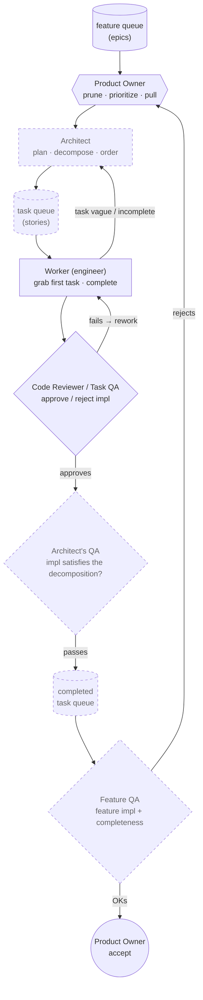

# v3 target architecture — the fully-staffed agile org

Owner-designed (2026-07-18). Today's platform is a single-tier loop (Worker + QA under
one Foreman). v3 adds the two roles the drills proved missing — an **Architect**
(decomposer) and a **feature/task two-tier pipeline with feedback loops** — turning the
platform from a *task executor* into a *feature-delivering org* where the human stays
Product Owner. Solid = exists today; dashed = the v3 build.

## Mapping to today

| v3 role | Status | Today's component |
|---|---|---|
| Product Owner (prioritize + accept) | partial | You — manual queue + approval gate |
| **Architect** (decompose feature→tasks) | **missing** | — (you decompose by hand) |
| Worker | live | The engineer (`pi-run` / `pi-queue`) |
| Code Reviewer / Task QA | live | Gates (deterministic + model review) |
| **Architect's QA** (impl satisfies the *decomposition*) | **missing** | — |
| **Feature QA** (whole feature complete) | **missing** | — (only per-task beacons verified) |
| feature queue → task queue (two tiers) | **missing** | One flat queue |
| **feedback edges** (revisit / rework / reject) | **missing** | *The no-retry gap the drills proved* |

## What v3 adds, and why it's right

- **The Architect is the decomposer** — the missing refinement role. It turns a prioritized
  feature into an ordered task queue, and takes vague tasks *back* ("revisit"). Its guardrail
  inverts from the others: you cannot verify a goal, so the **owner ratifies the decomposition
  and its success criteria up front** (immutable-seed pattern), rather than verifying after.
- **Two-tier QA** — task-level (does this task's impl pass?) *and* feature-level (is the whole
  feature actually done?). "All tasks passed" and "the feature works" are different questions.
- **Architect's QA** is the subtle, novel one — it checks the impl satisfied the *decomposition*,
  catching a Worker that does *a* task correctly but not *the* task that was ordered.
- **The feedback edges are the self-repair the drills demanded.** Worker→Architect (revisit),
  TaskQA→Worker (rework), FeatureQA→PO (reject) are exactly the retry/escalation loops a single
  drill-1 failure proved absent (a failed job just died). The owner drew them before the drill
  demonstrated the need.

## The one hard prerequisite

Every arrow is a governed model call. v3 has ~6 model stages per feature vs. ~2 today, so it
*multiplies* the plan-phase reliability problem drill 1 exposed. **v3 must be built on the
reliability foundation first** — retry-then-escalate, KV-cache reuse, per-phase collars — or a
feature gets six chances to time out instead of one. Order: harden the single loop → then staff
the org.
