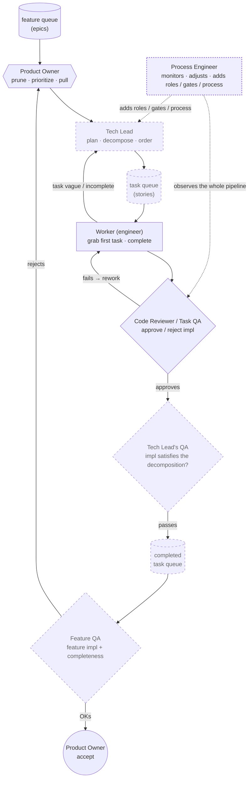

# v3 target architecture — the fully-staffed agile org

Owner-designed (2026-07-18). Today's platform is a single-tier loop (Worker + QA under
one Foreman). v3 adds the two roles the drills proved missing — a **Tech Lead**
(decomposer) and a **feature/task two-tier pipeline with feedback loops** — turning the
platform from a *task executor* into a *feature-delivering org* where the human stays
Product Owner. Solid = exists today; dashed = the v3 build.

The **Process Engineer** is the recursive apex: it improves the *process*, not the
product. It watches the pipeline and adds roles, gates, and process steps — the role
that makes the *organization* self-improving, not just the tasks. Today it is done by
hand (the foreman + Librarian + the rule-10 "incidents become gates" discipline); every
gate and role added this session was the Process Engineer at work.

Its guardrail is the strictest of all, because it can modify the governance itself:
**the Process Engineer may freely ADD gates and roles, but WEAKENING a gate or amending
the constitution is owner-ratified only.** It is the "who watches the watchmen" role, and
it must never be able to relax its own constraints — the immutable kernel already enforces
exactly this for the gates. Automating it is the true end-state (a platform that improves
its own governance) and the most dangerous step; it comes last, and behind the tightest
owner gate.

## Mapping to today

| v3 role | Status | Today's component |
|---|---|---|
| Product Owner (prioritize + accept) | partial | You — manual queue + approval gate |
| **Tech Lead** (decompose feature→tasks) | **missing** | — (you decompose by hand) |
| Worker | live | The engineer (`pi-run` / `pi-queue`) |
| Code Reviewer / Task QA | live | Gates (deterministic + model review) |
| **Tech Lead's QA** (impl satisfies the *decomposition*) | **missing** | — |
| **Feature QA** (whole feature complete) | **missing** | — (only per-task beacons verified) |
| feature queue → task queue (two tiers) | **missing** | One flat queue |
| **feedback edges** (revisit / rework / reject) | **missing** | *The no-retry gap the drills proved* |
| **Process Engineer** (improves the process) | partial, by hand | Foreman + Librarian + rule-10 (incidents→gates) |

## What v3 adds, and why it's right

- **The Tech Lead is the decomposer** — the missing refinement role. It turns a prioritized
  feature into an ordered task queue, and takes vague tasks *back* ("revisit"). Its guardrail
  inverts from the others: you cannot verify a goal, so the **owner ratifies the decomposition
  and its success criteria up front** (immutable-seed pattern), rather than verifying after.
- **Two-tier QA** — task-level (does this task's impl pass?) *and* feature-level (is the whole
  feature actually done?). "All tasks passed" and "the feature works" are different questions.
- **Tech Lead's QA** is the subtle, novel one — it checks the impl satisfied the *decomposition*,
  catching a Worker that does *a* task correctly but not *the* task that was ordered.
- **The feedback edges are the self-repair the drills demanded.** Worker→Tech Lead (revisit),
  TaskQA→Worker (rework), FeatureQA→PO (reject) are exactly the retry/escalation loops a single
  drill-1 failure proved absent (a failed job just died). The owner drew them before the drill
  demonstrated the need.

## The recursion continues: Enterprise Process Engineer

The roles form a fractal — each level does its work, improves the process at its scope,
and is ratified by the level above:

| Role | Improves | Scope |
|---|---|---|
| Worker | nothing (executes) | one task |
| Tech Lead | features (decomposes) | one feature |
| Process Engineer | the process | one pipeline / deployment |
| **Enterprise Process Engineer** | the process *across* pipelines | the fleet / the harness itself |

The **Enterprise Process Engineer** standardizes gates and roles across every deployment,
propagates a good gate found in one pipeline to all of them, benchmarks the industry for
practices worth adopting, and allocates shared resources across orgs. **Its artifact is
this repo.** The reference deployment has its own Process Engineer (per-instance); when a
gate or pattern proves out there, extracting it — generalized — into flywheel-harness *is*
the Enterprise Process Engineer promoting a local improvement to the shared standard. The
prior-art survey (95 projects, 24 adopted mechanisms) was this role scanning the industry.

Same guardrail, higher stakes: an enterprise-level change to the shared constitution
propagates to every deployment, so *weakening* the standard is the most tightly
owner-ratified action in the whole system. Adding is free; loosening is never automatic.

## The one hard prerequisite

Every arrow is a governed model call. v3 has ~6 model stages per feature vs. ~2 today, so it
*multiplies* the plan-phase reliability problem drill 1 exposed. **v3 must be built on the
reliability foundation first** — retry-then-escalate, KV-cache reuse, per-phase collars — or a
feature gets six chances to time out instead of one. Order: harden the single loop → then staff
the org.
